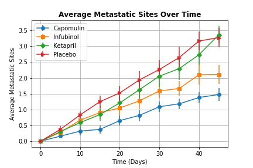
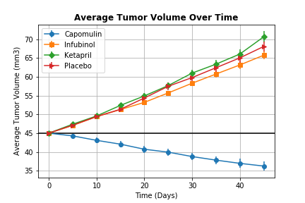
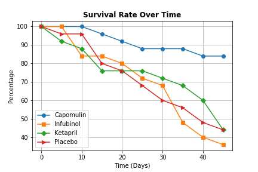
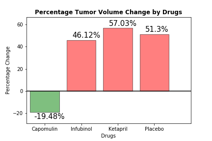

# ANALYZING DRUG TREATMENT AT  PYMACEUTICALS INC.

## EXECUTIVE SUMMARY
Pymaceuticals Inc. is a burgeoning pharmaceutical company based out of San Diego, CA that specializes in drug-based, anti-cancer pharmaceuticals. In their most recent efforts, they've since begun screening for potential treatments to squamous cell carcinoma (SCC), a commonly occurring form of skin cancer. In this study, 250 mice were treated through a variety of drug regimes over the course of 45 days. Their physiological responses were then monitored over the course of that time. The objective is to analyze the data to show how four treatments (Capomulin, Infubinol, Ketapril, and Placebo) compare.

## DATA
Two data sets are available for analysis. First data set includes the 250 rows of data about the id of mice and the drugs used. Second data set includes 1893 rows of data with the tumor volumes and metastasic sites of the mice over 45 days. Data sets are obtained in csv file format. Data sets do not have any missing values. 

## METHODS USED
Pandas and Matplotlib libraries in Python programming language are used for the analysis. Two data sets are are combined with left merging method, grouped and pivoted in different ways. Scatter plots are created to visualize and compare the outcomes of four treatments. 

## ANALYSIS
We observe that Capomulin is the only drug decreased tumor volume from 45 mm3 to 36 mm3 in 45 days. Infubinol, Ketapril, and Placebo are not succesful to lower tumor volume over time. Ketapril treatment increased tumor volume the highest by 57% percentage change in 45 days. Infubinol is better at slowing down the increase of tumor volume comparing to Ketapril and Placebo after 45 days. On the other hand, while all mice treated with Capomulin survived in first 10 days, Infubinol has the lowest number of survivals by nearly %15 decrease.

We see that metastatic sites increased over time in all drug treatments. Ketapril has the highest number of metastatic sites at the end of 45 days. Although tumor volume increase is higher in Ketapril and Placebo; Infubinol treatment has the lowest survival rate at the end of 45 days. 

  
 

## CONCLUSIONS & RECOMMENDATIONS

According to data Capomulin provides the best results in terms of survival rate and tumor volume decrease. Although Infubinol shows better results at slowing the increase of tumor volume comparing to Ketapril and Placebo, it has the lowest survival rates at the end of 45 days.

