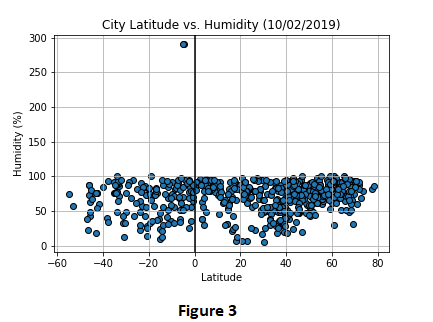

# ANALYZING WEATHER 

## EXECUTIVE SUMMARY
This project analyzes the weather of randomly selected 571 cities  across the world of varying distance from the equator. The objective is to observe whether the distance of the city from equator has an effect on temperature, humidity, cloudiness and wind speed or not.

## DATA
635 raws of data is available. 64 raws of data is ignored since there are missing values. 571 raws of data that includes cities with their maximum temperature, humidity, cloudiness and wind speed values. Data is retrieved on 2 October 2019. 

## DATA LIMITATIONS
It is estimated that 68% of the Earth's land exists in the Northern Hemisphere, while 32% is located in the Southern Hemisphere. Since this is the case, we will have less cities generated from the Southern Hemisphere. 

Temperature is not only affected by distance to the equator but also affected by other climate factors. 

## TOOLS & METHODS USED
Citipy library is used to randomly select 635 cities across the world. Citipy is a library that look for nearest city with geo coordinates. Cities are selected randomly with the random function with the help of this library.

Open Weather API is used for retrieving the real time values of temperature, humidity, cloudiness and wind speed for these cities with geo coordinates if their data is available on Open Weather API.

 Following series of scatter plots built using Matlpotlib library in order to mark the relationship between temperature, humidity, cloudiness, wind speed and location.

* Temperature (F) vs. Latitude
* Humidity (%) vs. Latitude
* Cloudiness (%) vs. Latitude
* Wind Speed (mph) vs. Latitude

## ANALYSIS & CONCLUSIONS
Geolocations of the cities are visualized with the scatter plot of longtitude vs. latitude (Figure 1) and we see that they are succesfully randomly generated. 

When we look at Figure 2, we see a trend that being located closer to the equator increases the maximum temperature since the cities located at the equator (latitude = 0) have high temperatures. If we have a closer look we observe some cities in both Northern and Southern Hemisphere with a maximum temperature. Those cities are at latitude = 20, which are not located at the equator. This plots tell us that distance to the equator is not the only factor for determining the maximum temperature. 

 

When we look at Figure 3, we see that humidity is not affected from the geolocation and indifferent to the distance from equator. We see one city with a 300% humidity, which is an outlier. 

 

When we look at the scatter plot in Figure 4, it is hard to talk any relationship or correlation between cloudiness and latitude. We can say that cloudiness is independent from latitude. 

 

Looking at the Figure 5, we see that wind speed is increased in some cities far from equator. It is not generally true and does not apply to all the cities far from equator looking at the plot. There may be other climate factors affecting wind speed. 

