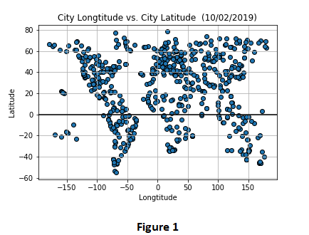

# ANALYZING WEATHER 

## EXECUTIVE SUMMARY
This project analyzes the weather of randomly selected 552 cities across the world of varying distance from the equator. The objective is to observe whether the distance of the city from equator has an effect on temperature, humidity, cloudiness and wind speed or not.

## DATA
607 raws of data is available. 55 raws of data is ignored since there are missing values. 552 raws of data that includes cities with temperature, humidity, cloudiness and wind speed values are used for analysis. 

## TOOLS & METHODS USED
Citipy library is used to randomly select 607 cities across the world. Citipy is a library that look for nearest city with geo coordinates. Cities are selected randomly with the random function with the help of this library.

Open Weather API is used for retrieving the real time values of temperature, humidity, cloudiness and wind speed for these cities with geo coordinates if their data is available on Open Weather API

 Following series of scatter plots built using Matlpotlib library in order to mark the relationship between temperature, humidity, cloudiness, wind speed and location.

* Temperature (F) vs. Latitude
* Humidity (%) vs. Latitude
* Cloudiness (%) vs. Latitude
* Wind Speed (mph) vs. Latitude

## ANALYSIS
We can observe the randomly generated cities' geolocations by visualizing the scatter plot of longtitude vs. latitude (Figure 1)

 
 
 

## CONCLUSIONS & RECOMMENDATIONS

According to data 

