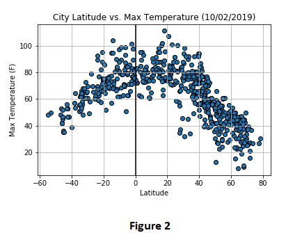
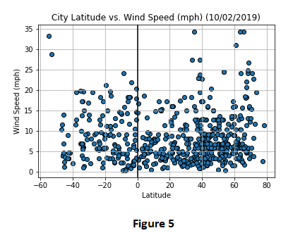

# ANALYZING WEATHER 

## EXECUTIVE SUMMARY
This project analyzes the weather of randomly selected 607 cities across the world of varying distance from the equator. The objective is to observe whether the distance of the city from equator has an effect on temperature, humidity, cloudiness and wind speed or not.

## DATA
Two data sets are available for analysis. First data set includes the 250 rows of data about the id of mice and the drugs used. Second data set includes 1893 rows of data with the tumor volumes and metastasic sites of the mice over 45 days. Data sets are obtained in csv file format. Data sets do not have any missing values. 

## TOOLS & METHODS USED
Citipy library is used to randomly select 607 cities across the world. Citipy is a library that look for nearest city with geo coordinates. Cities are selected randomly with the random function. Openweather API is used for retrieving the real time values of temperature, humidity, cloudiness and wind speed of a location with geo coordinates. 

 Following series of scatter plots built using Matlpotlib library in order to mark the relationship between temperature, humidity, cloudiness, wind speed and location.

* Temperature (F) vs. Latitude
* Humidity (%) vs. Latitude
* Cloudiness (%) vs. Latitude
* Wind Speed (mph) vs. Latitude

## ANALYSIS
We can observe the randomly generated cities' geolocations by visualizing the scatter plot of longtitude vs. latitude (Figure 1)

 
 
 

## CONCLUSIONS & RECOMMENDATIONS

According to data Capomulin provides the best results in terms of survival rate and tumor volume decrease. Although Infubinol shows better results at slowing the increase of tumor volume comparing to Ketapril and Placebo, it has the lowest survival rates at the end of 45 days.

