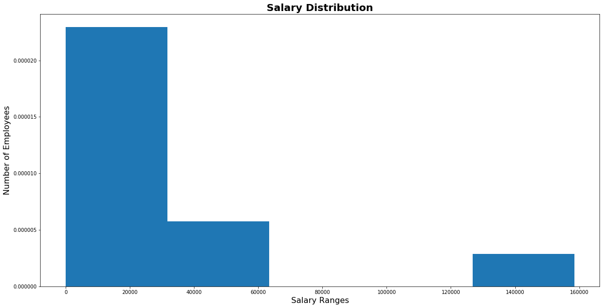

# Employee Database

In this project, the database of employees of the Pewlett Hackard corporation from the 1980s and 1990s is analyzed. Tables are designed to hold data in the CSV and then those CSVs are imported into a SQL database. 

Data Modeling, Data Engineering, and Data Analysis skills are performed to derive results. 

Here are the list of instructions carried out in the project:

#### Data Modeling

CSVs are inspected and  Entity Relationship Diagram (ERD) of the tables are sketched.

#### Data Engineering

* A table schema is created for each CSV files. Data types, primary keys, foreign keys, and other constraints are specified.

* Each CSV file is imported into the corresponding SQL table.

#### Data Analysis

Once the database is complete, following steps are taken:

1. The following details of each employee is listed: employee number, last name, first name, gender, and salary.

2. The employees who were hired in 1986 is listed.

3. The manager of each department is listed with the following information: department number, department name, the manager's employee number, last name, first name, and start and end employment dates.

4. The department of each employee is listed with the following information: employee number, last name, first name, and department name.

5. All employees whose first name is "Hercules" and last names begin with "B" are listed.

6. All employees in the Sales department, including their employee number, last name, first name, and department name are listed.

7. All employees in the Sales and Development departments, including their employee number, last name, first name, and department name are listed.

8. In descending order, the frequency count of employee last names is listed (i.e., how many employees share each last name).

9. A visualization of the data is generated by using Python. SQL database is imported to Pandas. 

* A histogram is created to visualize the most common salary ranges for employees.

* A bar chart is created to visualize average salary of employees by title. 

