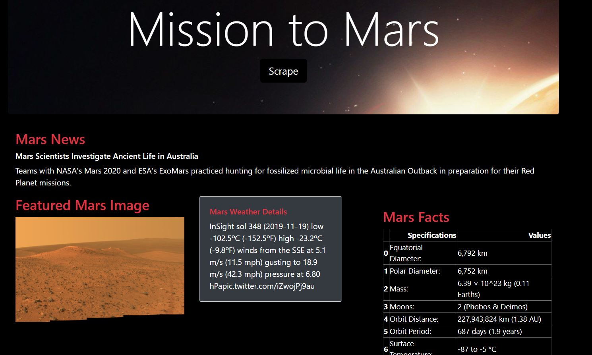

# Mission to Mars
Various websites for including information and image data related to the Mars scraped, collected into MongoDB database and then displayed in a HTML page using Flask app.

### NASA Mars News
Latest news title and text paragraph were scraped from [NASA web page](https://mars.nasa.gov/news/ "NASA web page") 
### JPL Mars Space Images - Featured Image
Featured Mars Image (full size) url was scraped from related page of NASA.
### Mars Weather
[Mars Weather Twitter account](https://twitter.com/marswxreport "Mars Weather Twitter account") was scraped and the latest tweet retrieved to obtain the Mars weather data.
### Mars Facts
[Mars Facts webpage](https://space-facts.com/mars/ "Mars Facts webpage") was scraped and the table containing facts about the planet retrieved with the help of Pandas library in Python.
### Mars Hemispheres
[USGS Astrogeology web page](https://astrogeology.usgs.gov "USGS Astrogeology web page") was scraped and the full resolution images for each of Mars hemispheres were obtained. 

