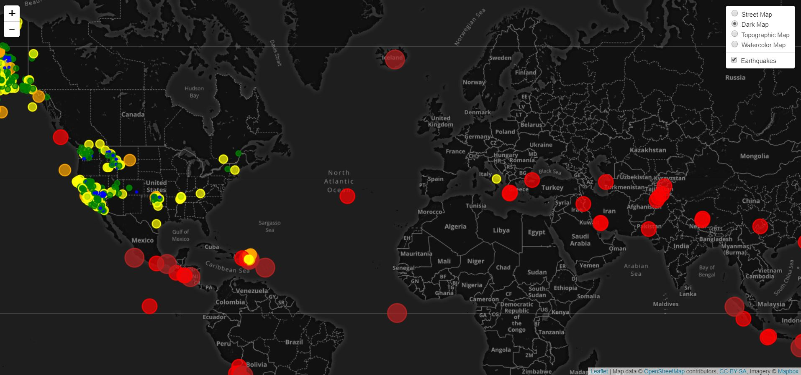

# Earthquake Visualization
Visualizing the earthquakes occurred in the last 7 days using USGS GeoJSON data. 

The project can be viewed at [Earthquakes in Last 7 Days Web Page](https://ahmedgurbuz.github.io/SMU_Assignments/WK_17_Mapping_Web/index.html "Earthquakes in Last 7 Days Web Page"). 

