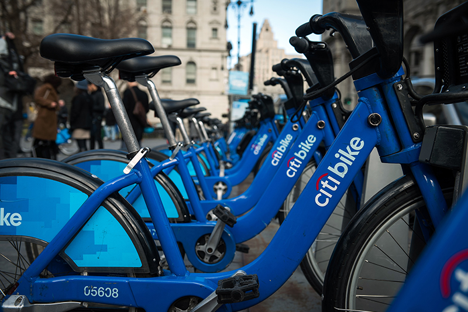

# New York CitiBike Bike Trip Data Analysis for 2018

 

## Project Summary
In this project, [CitiBike Data](https://www.citibikenyc.com/system-data/ "CitiBike Data") is analyzed for the year 2018. CitiBike share enables quick, easy, and affordable bike trips around the New York city boroughs.

Goal of the project is to find answers to the usage of Citibikes.

## Data
All the data (17548339 rows of trip data) is retrieved and then sample data is pulled. In order to pull the sample data, all data is sliced (fraction of 0.001) randomly in each month of 2018 and then merged with Python. Sample data consists of 17550 rows of trip data. 

The data includes:

Trip Duration (seconds) 
Start Time and Date 
Stop Time and Date 
Start Station Name 
End Station Name 
Station ID 
Station Lat/Long 
Bike ID 
User Type (Customer = 24-hour pass or 3-day pass user; Subscriber = Annual Member) 
Gender (Zero=unknown; 1=male; 2=female) 
Year of Birth 

### Project is published at Tableau Public.
